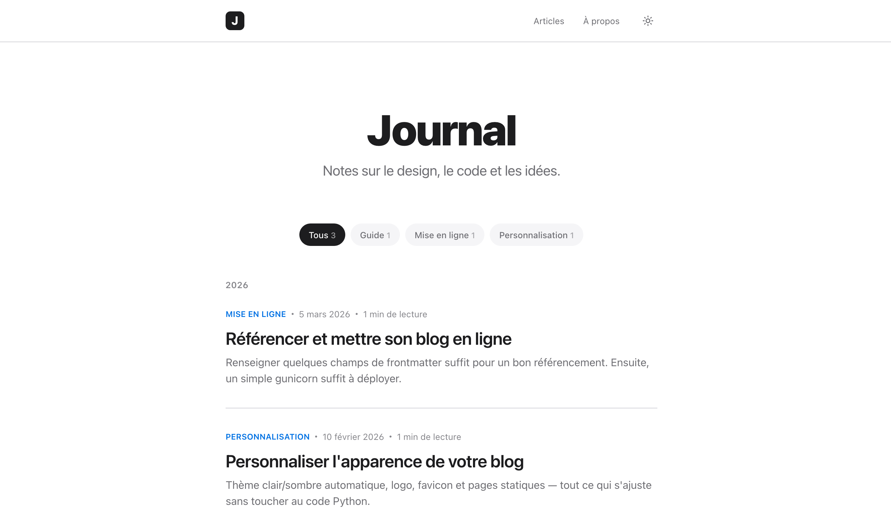

# Journal

A minimalist blog engine built with Flask and Markdown. Minimalist design, light/dark theme, no database. Every article and page is just a folder with a Markdown file.




## Table of contents

- [Features](#features)
- [Tech stack](#tech-stack)
- [Getting started](#getting-started)
- [Writing an article](#writing-an-article)
- [Adding a static page](#adding-a-static-page)
- [SEO](#seo)
- [Logo and favicon](#logo-and-favicon)
- [Project structure](#project-structure)
- [Deployment](#deployment)
- [Contributing](#contributing)
- [License](#license)

## Features

- **No database**. Articles and pages are Markdown files read from disk on each request. Deploy by pushing files, back up with a simple `cp`.
- **Markdown content** with YAML frontmatter (title, date, summary, category, SEO fields).
- **Categories** generated automatically from frontmatter, each with its own filtered, paginated page.
- **Pagination** on the homepage and category pages.
- **Automatic light/dark theme**, following the visitor's OS preference, with a manual override persisted in `localStorage`.
- **Reading time** estimated automatically from word count.
- **SEO built in**: unique title/description per page, canonical URLs, Open Graph and Twitter Card tags, `schema.org/BlogPosting` JSON-LD on articles, auto-generated `/sitemap.xml` and `/robots.txt`.
- **Per-article/page images**, served from each content folder's own `imgs/` subfolder. No shared media library to manage.
- **Custom 404 page**, French-localized dates, and a clean, distraction-free reading layout.

## Tech stack

- [Flask](https://flask.palletsprojects.com/): web framework
- [python-frontmatter](https://github.com/eyeseast/python-frontmatter): YAML frontmatter parsing
- [Python-Markdown](https://python-markdown.github.io/): Markdown rendering (`fenced_code`, `codehilite`, `tables`, `extra` extensions)
- Jinja2 templates, plain CSS (custom properties for theming), vanilla JS (no build step, no frontend framework)

## Getting started

Requires Python 3.10+.

```bash
git clone https://github.com/<your-username>/<your-repo>.git
cd <your-repo>
python3 -m venv venv
source venv/bin/activate
pip install -r requirements.txt
python app.py
```

The site is now available at http://127.0.0.1:5000.

To enable Flask's auto-reload and interactive debugger during development:

```bash
FLASK_DEBUG=1 python app.py
```

Never enable `FLASK_DEBUG=1` on a publicly exposed server: Flask's interactive debugger allows arbitrary code execution. It stays off by default.

## Writing an article

Each article is a folder under `posts/`, containing an `index.md` file and an `imgs/` subfolder for its own images. For example, `posts/2026-04-01-my-article/`:

```
posts/2026-04-01-my-article/
  index.md
  imgs/
    photo.jpg
```

```markdown
---
title: My new article
date: 2026-04-01
summary: A short description shown in the article list.
category: Design
---

The article's content, in Markdown (headings, lists, code, quotes...).


```

The folder name has no effect on the URL, the article is served via its slug, derived from the frontmatter (or the folder name if `slug` isn't set). It appears automatically on the homepage, sorted by date descending.

Images placed in `imgs/` are referenced with a relative path (`imgs/photo.jpg`) and are automatically served at `/post/<slug>/imgs/photo.jpg`, no extra configuration needed.

`category` is optional (defaults to "Général"). Each category automatically generates a filtered page at `/categorie/<category-name>`, with an article count.

## Adding a static page

A page follows the same pattern as an article, but has no date or category, and lives in `pages/` instead of `posts/`. It's served at the site root rather than under `/post/`. For example, `pages/about/index.md` produces the page `/about`:

```
pages/about/
  index.md
  imgs/
    photo.jpg
```

```markdown
---
title: About
meta_description: A search-engine-optimized description.
keywords: keyword one, keyword two
image: imgs/photo.jpg
---

The page's content, in Markdown. Same rules as an article (headings, lists, code, quotes, images via `imgs/photo.jpg`...).
```

Only `title` is required; `meta_description`, `keywords`, and `image` are optional and work exactly as they do for articles (see SEO below). The page is automatically included in `/sitemap.xml`, but **not** added to the site navigation. Add a link yourself in `templates/base.html` (`<div class="nav-links">`), like the existing one to `/about`.

The folder name becomes the page's slug/URL. Avoid naming a folder `static`, `post`, `categorie`, `sitemap.xml`, or `robots.txt`. These are already used by the site.

## SEO

Three optional frontmatter fields let you fine-tune each article's SEO:

```markdown
---
title: My new article
date: 2026-04-01
summary: A short description shown in the article list.
category: Design
meta_description: A search-engine-optimized description (150-160 characters).
keywords: keyword one, keyword two, keyword three
image: imgs/my-image.jpg
---
```

- `meta_description`: used in the `<meta name="description">` tag, Open Graph, and Twitter Card tags. Falls back to `summary` if absent.
- `keywords`: comma-separated list used in `<meta name="keywords">` (limited SEO impact today, but harmless).
- `image`: the article's featured image. Relative to the article's `imgs/` folder (e.g. `imgs/my-image.jpg`), or an absolute URL. Used as the social share image (`og:image`), the cover image at the top of the article page, and the thumbnail in article listings (homepage and category pages).

Every page also automatically generates: a unique title and description, a canonical URL, Open Graph / Twitter Card tags, and `schema.org/BlogPosting` JSON-LD structured data for articles. The site also exposes `/sitemap.xml` and `/robots.txt`.

## Logo and favicon

- The header logo is `static/img/logo.svg`.
- The site icon (browser tab) is `static/img/favicon.svg`.

Both are plain text (SVG) files. To change them, replace the corresponding file with another SVG (same name) or edit it directly, no code changes required. They're two separate files, so you can have a more detailed logo in the header and a simplified version for the favicon (often shown very small).

## Project structure

```
app.py                       # Flask server: loads and renders articles/pages
posts/<slug>/index.md        # one folder per article
posts/<slug>/imgs/           # images specific to that article
pages/<slug>/index.md        # one folder per static page (About, Contact...)
pages/<slug>/imgs/           # images specific to that page
templates/                   # base.html, index.html, post.html, page.html, 404.html, sitemap.xml
static/css/style.css         # all styling (automatic light + dark theme)
static/img/logo.svg          # header logo
static/img/favicon.svg       # site icon (browser tab)
```

## Deployment

This is a standard Flask (WSGI) app. It can be deployed as-is on Render, Railway, PythonAnywhere, Fly.io, etc., behind a production server like `gunicorn`:

```bash
pip install gunicorn
gunicorn app:app
```

## Contributing

Contributions are welcome: bug fixes, new features, documentation improvements.

1. Fork the repository and create a branch from `main`.
2. Keep changes focused; unrelated cleanups make review harder.
3. Follow the existing code style (docstrings and comments explain intent, not just mechanics).
4. Test locally (`python app.py`) before opening a pull request.
5. Open a pull request describing what changed and why.

For substantial changes, please open an issue first to discuss the approach.

## License

Distributed under the [MIT License](LICENSE).
